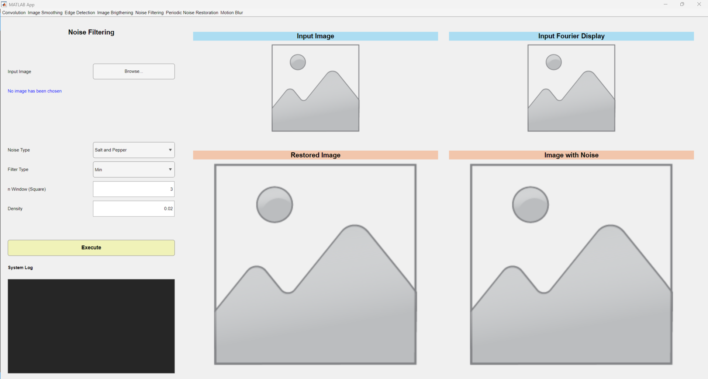

# TUGAS 21 Pemrosesan Citra Digital - IF4073
> Tugas 2: Image Filtering
## Anggota Kelompok
<table>
    <tr>
        <td>No.</td>
        <td>Nama</td>
        <td>NIM</td>
    </tr>
    <tr>
        <td>1.</td>
        <td>Jason Rivalino</td>
        <td>13521008</td>
    </tr>
    <tr>
        <td>2.</td>
        <td>Juan Christopher Santoso</td>
        <td>13521116</td>
    </tr>
</table>

## Table of Contents
* [Deskripsi Singkat](#deskripsi-singkat)
* [Requirements](#requirements)
* [Cara Menjalankan Program](#cara-menjalankan-program)
* [Tampilan GUI Program](#tampilan-gui-program)
* [Pembagian Kerja](#pembagian-kerja)
* [Acknowledgements](#acknowledgements)

## Deskripsi Singkat 
Program yang dibuat dalam tugas ini memiliki kegunaan utama untuk melakukan pemrosesan pada citra dalam domain spatial dan frekuensi. Terdapat beberapa fitur utama yang diimplementasikan dalam pengerjaan Tugas ini antara lain:
1. Pemrosesan citra dengan konvolusi
2. Image smoothing dalam domain spatial dan frekuensi dengan Low Pass Filter
3. Edge detection dalam domain frekuensi dengan High Pass Filter
4. Image brightening dalam domain frekuensi dengan metode Homomorphic
5. Noise filtering dalam domain spatial
6. Periodic noise restoration
7. Deconvolution untuk mengatasi motion blur

## Requirements
1. Matlab

## Cara Menjalankan Program
Langkah-langkah proses setup program adalah sebagai berikut:
1. Clone repository ini
2. Membuka Matlab lalu masuk ke dalam directory file tempat clone
3. Menjalankan file `image_filtering.mlapp` yang terdapat pada root directory
4. Menjalankan run setelah file terbuka
5. Program sudah bisa dijalankan

## Tampilan GUI Program

## Pembagian Kerja
<table>
    <tr>
        <td>No.</td>
        <td>Nama</td>
        <td>Kontribusi</td>
    </tr>
    <tr>
        <td>1.</td>
        <td>Jason Rivalino</td>
        <td>Pengerjaan image smoothing, edge detection, image brightening, motion blur deconvolution, dan laporan</td>
    </tr>
    <tr>
        <td>2.</td>
        <td>Juan Christopher Santoso</td>
        <td>Pengerjaan algoritma konvolusi, noise filtering, periodic noise restoration, pembuatan GUI, integrasi sistem dengan GUI, dan laporan</td>
    </tr>
</table>

## Acknowledgements
- Tuhan Yang Maha Esa
- Pak Rinaldi Munir sebagai Dosen Pemrosesan Citra Digital IF4073

